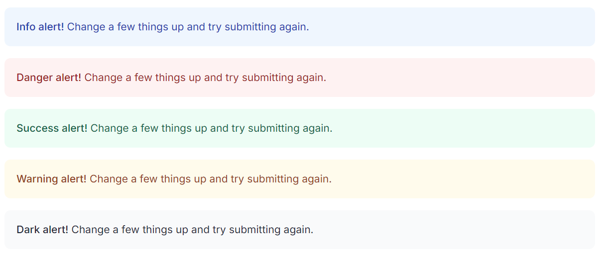
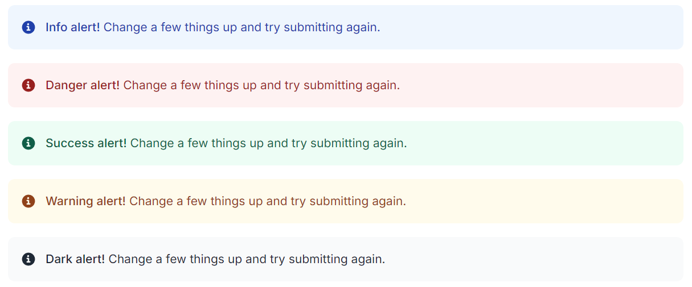
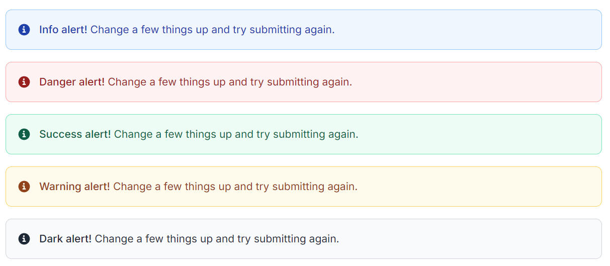
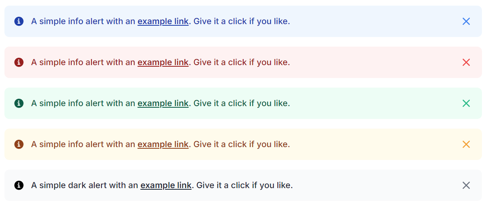

# Лабораторна робота №2. Створення компонентів з використанням Vue 3 та Tailwind CSS

## Мета:

1. Навчитися створювати базові компоненти у Vue 3.
2. Опанувати стилізацію компонентів за допомогою Tailwind CSS.
3. Практикувати передачу пропсів та обробку подій між компонентами.

## Засоби та інструменти:

- Vue 3
- Tailwind CSS
- Node.js (для встановлення залежностей)
- npm або yarn для управління пакетами

## Завдання

1. Налаштування проекту Vue 3 з Tailwind CSS на базі проекту з попередньої лабораторної роботи.

 ```bash
  #Встановіть та налаштуйте Tailwind CSS відповідно до офіційної документації:
  npm install -D sass-embedded
  npm install -D tailwindcss@3 postcss autoprefixer
  npx tailwindcss init -p
  ```

2. Налаштувати `tailwind.config.js` за необхідноті.

3. Створіть компонент `Button` за наступними функціональними вимогами:
    - Приймати наступні пропси:
        - `label`: Текст кнопки.
        - `color`: Кольорова тема кнопки (наприклад, червона, синя).
        - `size`: Розмір кнопки (маленька, середня, велика).
        - `icon`: Іконка для кнопки (необов’язкова).
    - Використайте Tailwind для стилізації кнопки з урахуванням пропсів.
    - Додайте можливість обробки події `click` на кнопці.
4. Створіть компонент `Alert`  за наступними функціональними вимогами:

Props

| Назва      | Тип                                           | Обов’язковий | Опис                                                          |
   |:-----------|:----------------------------------------------|:-------------|:--------------------------------------------------------------|
| `type`     | `'success' \| 'error' \| 'warning' \| 'info'` | ❌            | Тип повідомлення (визначає колір і стилі). За замовчуванням `'info'`. |
| `title`    | `string`                                      | ❌            | Заголовок повідомлення.                                       |
| `message`  | `string`                                      | ❌            | Основний текст повідомлення.                                  |
| `closable` | `boolean`                                     | ❌            | Якщо `true` — показати кнопку “✕” для закриття.               |
| `icon`     | `boolean`                                     | ❌            | Якщо `true` — показати іконку відповідного типу повідомлення. |
| `rounded`  | `boolean`                                     | ❌            | Контролює форму кутів. За замовчуванням `'md'`.               |
| `bordered`  | `boolean`                                    | ❌            |                                                               |
| `accent `  | `boolean`                                     | ❌            |                                                               |

5. Створіть сторінку з демо, яка відображатиме всі можливі комбінації параметрів для кожного з компонентів.
6. Розмістіть ваш проект в директорії `lab2` публічного репозиторію GitHub/GitLab/Bitbucket з назвою `<vendor>/mjsf-mag`
   та додайте посилання на репозиторій у звіт.

Приклади (варіації) компонента Alert







### Контрольні питання

- Що таке props у Vue.js і для чого вони використовуються?
- Які типи даних можна використовувати для пропсів у Vue? Як визначити тип пропсу?
- Як задати значення за замовчуванням для пропса у Vue?
- Що таке emits у Vue.js і для чого вони використовуються?
- Як передати подію з дочірнього компонента до батьківського компонента у Vue?
- Як визначити події, які компонент може "викидати" (emit)?
- Як можна обробляти події у батьківському компоненті, що надходять від дочірнього компонента?
- Що таке директиви у Vue.js і як вони відрізняються від компонентів?
- Які є вбудовані директиви у Vue.js, і які їхні основні призначення?
- Як створити власну директиву у Vue.js? Які основні етапи цього процесу?
