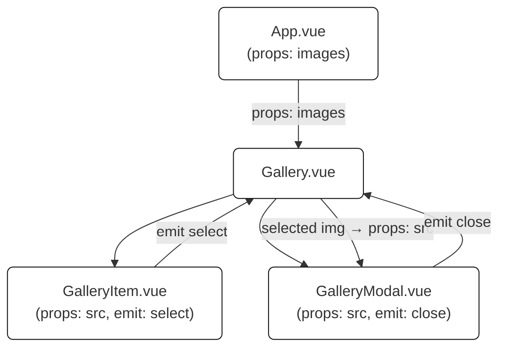
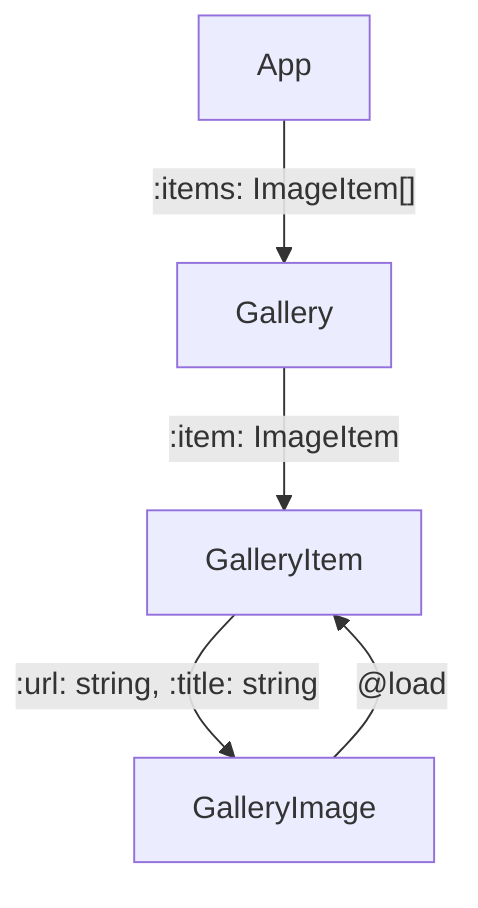

# Основи компонентів Vue.js

## Компонент Gallery


## Commands
1. Create project
    ```bash
     npm create vue@latest
     cd <project-dir>
     npm install
     npm run format
     npm run dev
    ```
2. Install TailwindCSS
   See: https://v3.tailwindcss.com/docs/guides/vite
    ```bash
     npm install -D sass-embedded
     npm install -D tailwindcss@3 postcss autoprefixer
     npx tailwindcss init -p
    ```
3. Configure TailwindCSS


