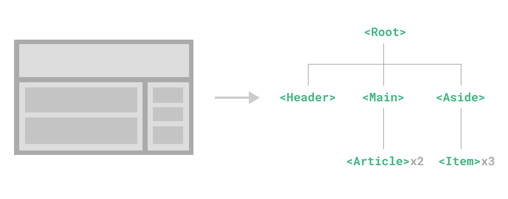
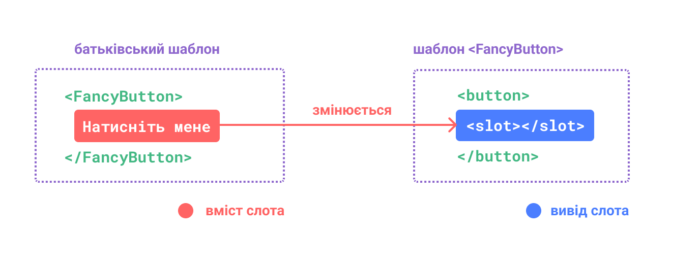
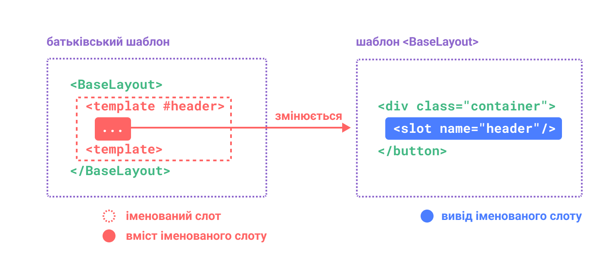

# Лекція №3. Компонети, слоти, Provide/Inject
## Основи компонентів
Компоненти дозволяють нам розділити інтерфейс користувача на незалежні частини, які можна багаторазово використовувати, і думати про кожну частину окремо. Зазвичай програму організовують у дерево вкладених компонентів:



Це дуже схоже на те, як ми вкладаємо рідні HTML-елементи, але Vue реалізує власну модель компонентів, яка дозволяє нам інкапсулювати власний вміст і логіку в кожному компоненті. Vue також чудово працює з рідними вебкомпонентами
Оголошення компонента​
Коли використовується етап збірки, як правило, ми визначаємо кожен компонент Vue у спеціальному файлі за допомогою розширення .vue, відомого як однофайловий компонент (скорочено SFC, скорочено від (англ.) Single File Component):
```vue
<script setup>
import { ref } from 'vue'

const count = ref(0)
</script>

<template>
  <button @click="count++">Ви натиснули на мене {{ count }} разів.</button>
</template>
```

## Cлоти
Компоненти можуть приймати властивості, якими можуть бути значення JavaScript будь-якого типу. 
Але у деяких випадках необхыдно передати фрагмент шаблону в дочірній компонент і дозволити 
дочірньому компоненту відтворити фрагмент у своєму власному шаблоні.
Наприклад, у нас може бути компонент <FancyButton>, який підтримує наступне використання:
```vue
<FancyButton>
  Натисніть мене! <!-- вміст слота -->
</FancyButton>
```
Шаблон <FancyButton> виглядає так:
```vue
<button class="fancy-btn">
  <slot></slot> <!-- вивід слота -->
</button>
```
Елемент <slot> — це вивід слота, який вказує, де має наданий батьком вміст слота відтворюватися.



Завдяки слотам, <FancyButton> відповідає за візуалізацію зовнішнього <button> (та його гарного стилю), тоді як внутрішній вміст надається батьківським компонентом.

Бувають випадки, коли для слота корисно вказати резервний вміст (тобто, вміст за замовчуванням), який буде відображатися лише тоді, коли вміст не надано. Наприклад, у компоненті <SubmitButton>:

```vue
<button type="submit">
  <slot>
    Надіслати <!-- резервний вміст -->
  </slot>
</button>
```

## Іменовані слоти
Бувають випадки, коли корисно мати кілька виводів в одному компоненті. Наприклад, у компоненті <BaseLayout> 
із таким шаблоном:
```vue
<div class="container">
  <header>
    <!-- Тут нам потрібен вміст заголовка -->
  </header>
  <main>
    <!-- Тут нам потрібен основний вміст -->
  </main>
  <footer>
    <!-- Тут ми хочемо вміст нижнього колонтитула -->
  </footer>
</div>
```
Для цих випадків елемент <slot> має спеціальний атрибут name, за допомогою якого можна призначити унікальний ідентифікатор різним слотам, щоб ви могли визначити, де має відтворюватися вміст:
```vue
<div class="container">
  <header>
    <slot name="header"></slot>
  </header>
  <main>
    <slot></slot>
  </main>
  <footer>
    <slot name="footer"></slot>
  </footer>
</div>
```
Вивід <slot> без name неявно має назву "default".
У батьківському компоненті, що використовує <BaseLayout>, нам потрібен спосіб передати кілька фрагментів вмісту слота, кожен з яких націлений на інший вивід слота.
Ось де з'являються іменовані слоти.
Щоб передати іменований слот, нам потрібно використати елемент <template> з директивою v-slot, а потім передати назву слота як аргумент v-slot:

```vue
<BaseLayout>
  <template v-slot:header>
    <!-- вміст для слота заголовка -->
  </template>
</BaseLayout>
```

v-slot має спеціальне скорочення , тому <template v-slot:header> можна скоротити до просто <template header>


